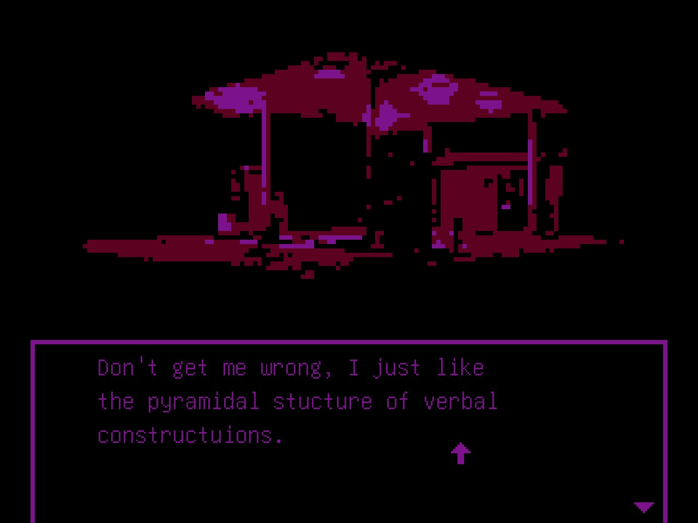

*Milk inside a bag of milk inside a bag of milk* is an interesting visual novel, which already puts it in a league above its peers. That statement comes from my disinterest in genre, as I find many of the games within it default to a *certain theme* that I don't find interesting. Ignoring that, the games themselves are rather bland with player interaction relegated to progressing the text and making a dialogue choice. Of course, it's a lot more expressive than a "Choose Your Own Adventure" book. Visual novels can immerse the player in their world though visuals and sound design, but their stories are limited similarly to their physical counterpart because of the scope of gameplay. 

This shouldn't imply visual novels are the only games fighting with this scope. *The Stanley Parable* follows a similar formula; hold forward to progress and make the occasional choice. At their core, narrative-driven games - visual novels, exploration and adventure games - are reliant on their stories to carry them. What makes exploration and adventure games different from visual novels comes from their use of gameplay to fall back on as they tell their story. Looking at *The Stanley Parable* again, it invites players to explore and find new jokes and endings, leveraging its position as a game to enhance the writing. All this to say that if a visual novel wants to succeed, its story better be good.

Luckily for *Milk inside a bag of milk*, it's story is fantastic even with its simple premise. It's a well-written exploration of mental health and trauma that is able to hit above its weight class. I won't be talking too much about the story directly since, much like the cup of coffee this game costs, it takes only 15 minutes to get through. Similarly to other narrative games, it's better to go in blind and discover the story for yourself than it is to be told what that story is. What I can say is that I found myself empathetic for the protagonists current situation, which everything in the game surrounds.

A minor aspect somewhat separate from the plot I found interesting was how self-aware the game was about its medium. While *Milk inside a bag of milk* does use its awareness of visual novels primary as a plot point, I found it's also utilized to take jabs at the genre. This is the most clear with the protagonist, who regularly makes comments regarding the clichés of its format. Alongside their dialogue, the choices for player response are often limited to rude remarks. In contrast to other visual novels - including *Doki Doki Literature Club*, whose story was a horrific subversion of the genre's stereotypes - there is no happy ending that's possible here; you either help the protagonist buy milk or you don't. What makes this awareness of visual novels even more enjoyable is how it's woven back into the plot.

If it's not clear by now, everything in *Milk inside a bag of milk* has a purpose. There's no material that doesn't support the plot. Even the visuals and soundtrack have their own explanations for being there, although their presence alone is reason enough. They produce an atmosphere of isolation with average locations taking on an alien feel. This is no doubt because of the visuals limited color palette and the accompanying ambient soundtrack. Both of these elements are incredibly unique in their execution, with the visuals being especially noteworthy to me as they were a enticing factor when I decided to purchase the game. 

With all that said, *Milk inside a bag of milk inside a bag of milk* is a great story that worth experiencing. If you have some pocket change lying around and you're comfortable confronting sensitive subject matters such as abuse, mental health and death, this is a visual novel well worth looking into. It's a creative idea that I throughly appreciate and hope to see more of in the genre.

You can purchase *Milk inside a bag of milk inside a bag of milk* on [Steam](https://store.steampowered.com/app/1392820) and [itch.io](https://nikita-kryukov.itch.io/pmkm).