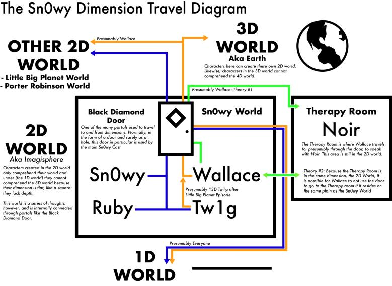

As of recent, my friends [Cocodotts](https://twitter.com/cocodotts), [Kalil](https://twitter.com/kvlmiv) and I have been working on a ~~podcast~~ live show where we talk about [wallaceprower's](https://twitter.com/wallaceprower "Also known for sleeping on a couch and talking to his phone during graduation.") [*Sn0wy*](https://www.youtube.com/c/Sn0wyYT "Give us the password already.") series. Our last episode gave me the excuse to look back at some of the fundamental lore of the series, that being it's use of *LittleBigPlanet's* Imagisphere. As I was forming my notes for the episode I ended up reconsidering how the Imagisphere works within the series, challenging the way we previously discussed the lore as well as how it has been presented. I didn't manage to get my thoughts either fully or clearly, so this post is dedicated to remedying that. 

You could also consider this my attempt to redeem myself, because I do realize that what I was spouting was so nonsensical it wasn't even funny. Either that or the embarrassment of hearing myself stumbling over my words while others flawlessly come up with sentiences is getting to me again.

## Similarities to the Craftverse

As unorthodox as it seems, talking about *LittleBigPlanet* is worthwhile when discussing the Imagisphere within *Sn0wy*. It's interpretation of the Imagisphere utilizes many of the same core concepts that *LittleBigPlanet* establishes, with the big three being its ties to imagination, creator curators, and badges. The first point should be obvious as *LittleBigPlanet's* boot screens describe how our idle thoughts join up with others to create the planets and moons around the Imagisphere or, as Wallace put it, "[The Imagisphere is a dimension made up of nothing but thoughts and ideas from millions of human beings.](https://youtu.be/kF_oPS7Hv5k?t=559)"

Wallace also describes how people "create these worlds in their minds that become planets in [...] the Imagisphere," which happens to fulfill the definition of a creator curator within *LittleBigPlanet*. They're the ones who build and maintain the various planets and moons that make up the Imagisphere, and while the label is mainly used to describe the characters within the game's story the [*LittleBigPlanet* wiki](https://littlebigplanet.fandom.com/wiki/Creator_Curator) describes the player as being one of these curators.

Finally, there's the minute detail of badges. These function as level selectors in *LittleBigPlanet*, dragging the player from the game's hub area to the world within the badge. Similarly, the Black Diamond Door seen within *Sn0wy* bridges the gap between two different worlds and are even able to take on a more circular shape. Overall, there's actual reason to consider *Sn0wy* and *LittleBigPlanet* together, as they're quite closely connected in how they use the Imagisphere. And I didn't even mention the [*LittleBigPlanet* episode](https://www.youtube.com/watch?v=TTa08dh3uac) that permanently altered Tw1g's appearance. 

## Bringing It H0me

While it's use of the Imagisphere is near identical to *LittleBigPlanet*, *Sn0wy* differentiates itself with its use of dimensions. The concept was introduced by Wallace as he explained how people from the Third Dimension are able to create worlds in the Imagisphere, while those in the second dimension cannot. This is best understood with "The *Sn0wy* Dimension Travel Diagram", created by Cocodotts, which visualizes the relationship between the various cast members and their ability to navigate different worlds. Keep in mind that the yellow line represents those from the Third Dimension while the blue is for those from the Second Dimension.

As well put together as the diagram is, it's clear to see it's a bit convoluted. Within the image, there's questions regarding how Wallace is able to access the Therapy Room and if Tw1g is able to access the same areas as Wallace since their change in the *LittleBigPlanet* episode. Beyond the image, the episode "[VAPORWAVE & ESCAPISM](https://www.youtube.com/watch?v=FtYbr7RPDXw)" calls into question how accurate Wallace's understanding of the Imagisphere is with Sn0wy accidentally sending him and Clementine into another world. Discussion on the topic of multiple dimensions is itself a challenge to mentally visualize. Not to mention Noir's comment to Wallace that "[his] theory is a bit shaky in certain areas." 

To address these problems and to help with explanation, think of dimensions as layers. On the top layer you have someone like Wallace, a creator. Anything they create is in a second layer beneath them. This second layer has full flexibility to do whatever it wants; explore their world, visit the worlds of [other creators](https://youtu.be/kF_oPS7Hv5k?t=414), or potentially make their own layers. The only thing they can't do is go up to the same layer their creator is from. That said, nothing is stopping a creator from going down a layer to exist with their creations.

With this model, we're able to clarify a few ambiguous areas from the dimension diagram. Regarding how Wallace accesses the therapy room, it's likely a separate creation he made to seek advice and counseling for himself. Tw1g also wouldn't be able to go up a layer as the dimensional model hypothesizes because they're a creation from Wallace. The only questions left are those regarding Noir, who seems to be in the position to try and gain access to the third dimension for reasons we can only speculate.

Chances are we'll never get answers to those lingering questions. Wallace has been slowly moving away from making video essays with a lore behind them, as the progression from *OVRGRWN* to *wallaceprower* shows. It's understandable that Wallace would want to try and express his interests without the limitation of having to also tell a cohesive story. For what it's worth, *Sn0wy* was a breath of fresh air in a saturated genre of videos and it's always a treat to look back at it.